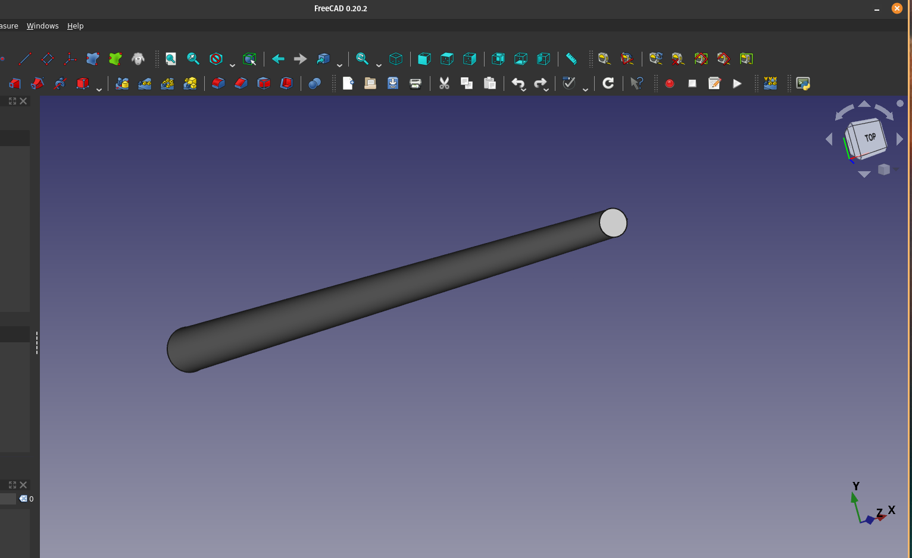
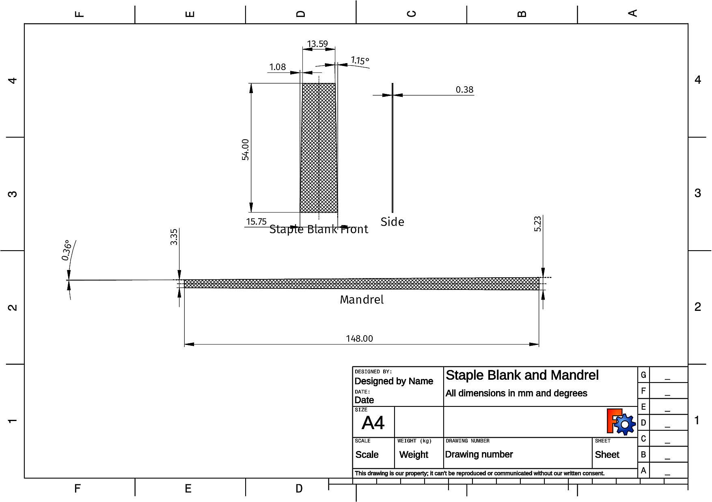
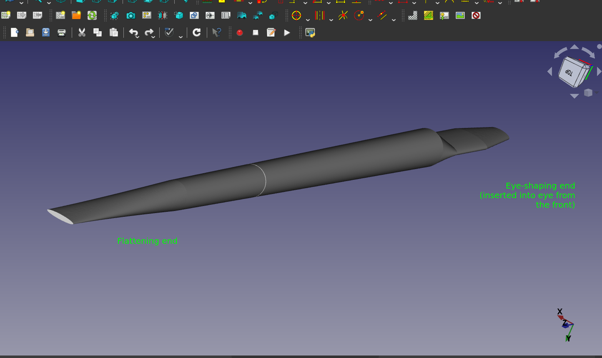
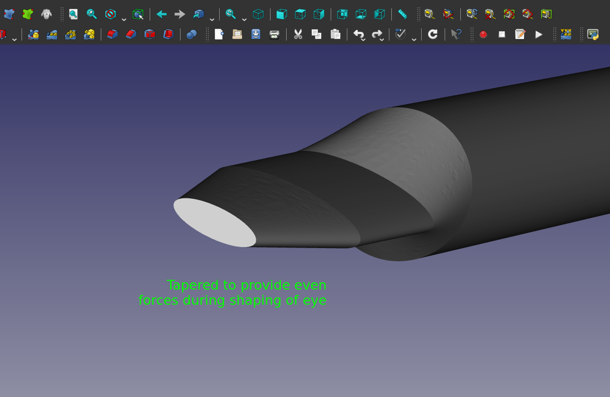
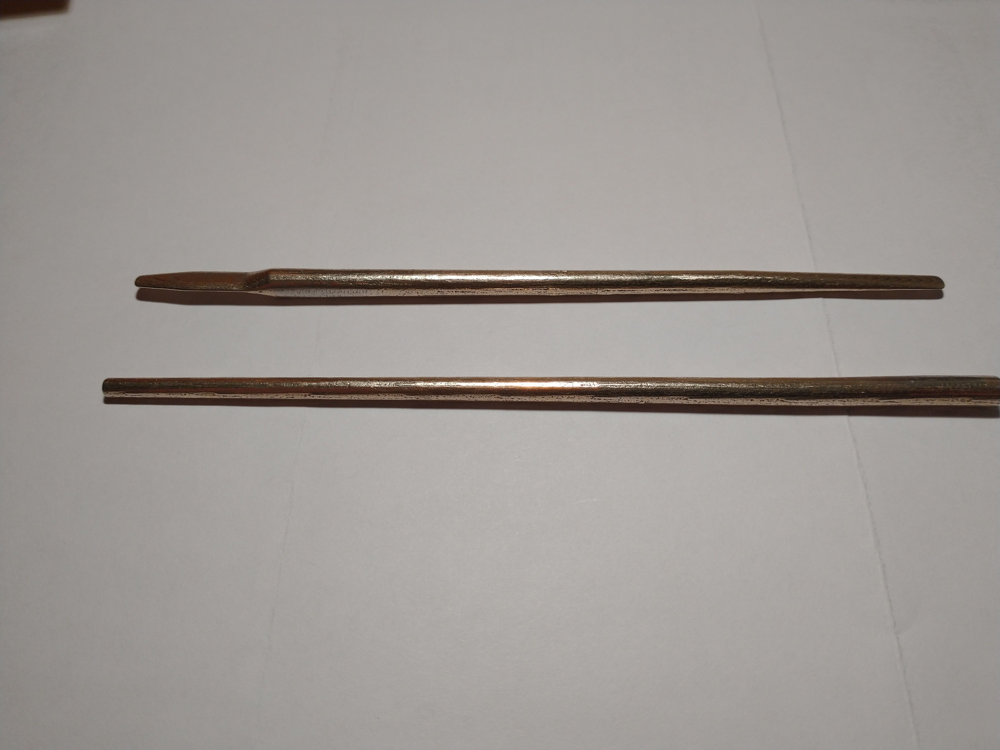
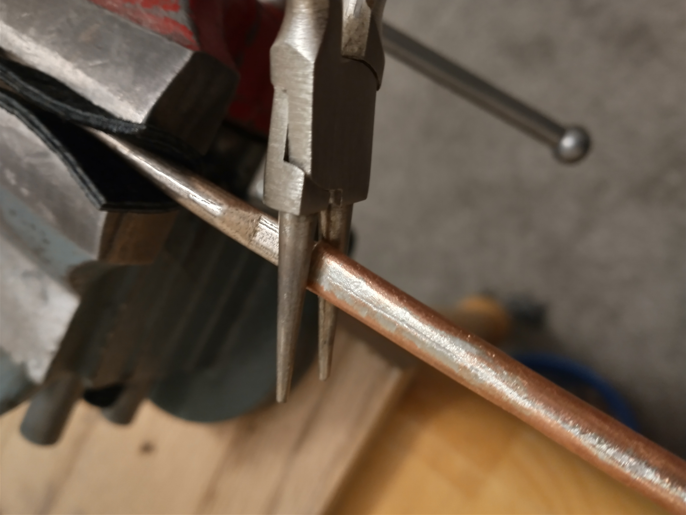

mandrels

[TOC]

FreeCAD files and resources that allow the creation of mandrels for rolling tapered staples and
other tubes used in Uilleann Pipe reedmaking and pipemaking.

# TLDR
TLDR (i.e., I don't need to customize my mandrel(s), but I want to get one printed or CNC machined; see pictures
below for possible mandrels):

1. If you just want to 3D print or CNC machine a staple rolling mandrel, download this project and upload one of
   the files in the `exports/rolling` folder to a commerical 3D printing service that prints steel, and order a
   "polished" finish. For CNC machining, use a high carbon steel, and submit the PDFs with diameter
   tolerances if required by a commercial vendor. NOTE: commercial companies may reject mandrels as infeasible since they are long and narrow, and have similar flexibility issues as encountered during normal machining; I have not had one accepted, but you may, especially if you use other processes like CNC grinding) 
2. If you want to print the special flattening and shaping mandrel pictured and described below, do
   the same as in step 1., but use one of the STL files in the `exports/shaping` folder. For CNC
   machining, use a high carbon steel, and submit the PDFs with diameter tolerances if required by a
   commercial vendor. Due to lack of demand, and the fact that each shaping mandrel need to be
   customized to the particular staple in more detail than the rolling mandrels, there may or may not be many exports in this directory.

Disclaimer: due to variations in material, I do not guarantee that any mandrel design included here, when printed and machined, will
fit your staple or use case.

# Examples
## Tapered Rolling Mandrel in FreeCAD
### Rolling mandrel

### Dimensioning Sheet Metal and a Mandrel for a Precise, Parameterized, Tapered and Rolled Tube

## Flattening and Eye-shaping Mandrel in FreeCAD
### The Mandrel in FreeCAD

### The Flattening and Rolling Mandrels 3D Printed

### The flattening Mandrel in Use
Round-nosed pliers can be used to squeeze and roll around the
circumference of the eye and swage and forge it around the tight-fitting shaping end of the mandrel.
The corners are prevented from collapsing by the parameterized fit according to your dimensions, and
pressure can be exerted forcefully at any single point around the circumference, by placing one jaw
on the mandrel, and the other on the staple eye, and continuing to roll and squeeze.

Arguably, the contour of the entire length of the taper has perhaps more effect on the force
imparted to the blades than does the eye, and that is accounted for by the flattening end of the
mandrel, which has a highly symmetric curved surface that doesn't need to be ground by hand.

### Resulting Highly Symmetrical Staple Eyes

# Introduction
This repository contains CAD files that model mandrels used for rolling any arbitrary tapered tube
shape from any thickness of sheet metal, as well as a custom-designed mandrel for flattening and shaping reed
staples, with particular emphasis on complete symmetry and reproducibility.

## Motivation
### 3D Printing and CNC Machining of Rolling Mandrels
Machining thin steel rod is very difficult, due to its flexibility, and grinding mandrels by hand is
time-consuming and imprecise.  Combined with modern, commercial 3D printing and CNC machining of stainless steel,
these CAD models provide relatively inexpensive access to a precision tool that is otherwise
difficult to acquire or make.

#### 3D Printing vs. CNC Machining
3D printing prices per printed item typically do not scale with quantity ordered, so this is the
best choice for low volume orders.  The accuracy and precision of the printed item is lower than CNC machining.

CNC machining costs per item machined scale dramatically with quantity ordered.  At the time of
writing, a quantity of about 5 mandrels led to the same price as 3D printing one mandrel, with the
costs continuing to decrease linearly from there, such that at quantity 20 or above, they are very
affordable. The accuracy and precision of CNC machining is very high compared to 3D printing.

#### Mandrels for Reed Staples
`rolling_mandrels/tapered_rolling_mandrel.FCStd` creates a mandrel of a specified length based on
staple dimensions, and dimensions it *such that the staple will be exactly centered on the mandrel
during the rolling process, according to its internal dimensions*. All the math required for this is
incorporated into the spreadsheet in the project, so all you have to do is enter your values, and
watch the model change.

#### Arbitrary Mandrels and Sheet Metal Dimensioning
Further, this same file may be used to model parameterized mandrels for rolling any size of
tapered (or non-tapered) tube from any thickness of sheet metal.  These may be later machined from
the technical drawings that this FreeCAD project provides, or printed from exported STL files (3D
printing cost increases with mass, and there are smaller size limits for printing steel, at this
point in time).

### Calculation of Sheet Metal Dimensions for Rolled Tubes of any Taper Angle and Size

As this subject heading indicates, file `rolling_mandrels/tapered_rolling_mandrel.FCStd` allows the
input of all parameters required to roll sheet metal into a tube of any taper angle, length, and small and large
diameters on either end, from any thickness of material.  This could be useful to pipers wanting to
roll sections of tubing for drones, chanter caps, etc.

### 3D Printing of Flattening Mandrels

Parameterized, symmetric flattening mandrel(s) can be printed using the files in
`flattening_shaping_mandrels/`. This eliminates the need to file or grind them by hand, which can be
a barrier to entry for some.

## Modes of use
The primary use of this project is to export STL files that can be used to 3D print mandrels
in stainless steel, or STEP files that can be used for CNC machining of mandrels; these are services that are provided commercially by a number of companies.  The
CAD files and included technical drawings may also be useful for designing or dimensioning mandrels
that are to be machined in a traditional manner.

## FreeCAD
If you want to customize your mandrel(s), you will need a basic understanding of FreeCAD; this can be
obtained in a couple of hours. Included is a helpful HackSpace *FreeCAD for Makers* article,
licensed separately under a Creative Commons Attribution-NonCommercial- ShareAlike 3.0 license
(https://creativecommons.org/licenses/by-nc-sa/3.0/) No material in this project is a derivative
work of any work in that article; it is included here solely for generic, educational purposes.

If you read the sections on understanding the FreeCAD interface, generating meshes from PartDesign
bodies (optional), and using Spreadsheets to enter parametric values for your particular use case,
you'll be up and running in no time.  In addition, consider searching for videos and tutorials
online to familiarize yourself with the FreeCAD UI.

# Basic instructions
## FreeCAD
### Installation
1. Install [FreeCAD](https://www.freecad.org/)
2. Clone or download this project as a zip archive and extract it into your filesystem

### Project Usage
1. Open a file in this repository that suits your needs
2. Enter values in the specified units in the Spreadsheet(s) prefixed with `spr_` in the object tree
3. View the resulting technical drawings to verify that all dimensions look OK.

For more complex geometries, when the parameter names are deemed not to be self-explanatory, there
is often an imported image of a technical drawing titled, for instance,
`README_spr_exampleSpreadsheet` that contains the *names* of the parameters in the spreadsheet
`spr_exampleSpreadsheet`, to show you which physical dimensions they correspond to, so you know what
values to choose for them based on your design. Technical drawing will also be generated for your
parameters, but this README is static, so it won't change and can thus serve as a stable reference.

### Exporting for 3D Printing
Do one of the following:

#### Standard STL Export
1. Select a Body in the object tree (the one you modelled) and click **File -> Export**
2. Select STL as the file type

#### Mesh Workbench
To fine tune the mesh of the object, use the Mesh Design workbench to create a mesh and export it to
an STL file. Files can become very large if you use very high precision facets.

### Exporting for CNC Machining
1. Select a Body in the object tree (the one you modelled) and click **File -> Export**
2. Select STEP as the file type (or whatever format you require; there are many options)

## 3D Printing

Find a company that 3D prints in stainless steel and offers a polished finish. Make sure your
mandrel doesn't exceed the maximum dimensions for the service (you won't be able to complete the upload
if it does), upload it, pay, and receive your precision tool in the mail some time later.  Make sure
to read the service's instructions for printing steel - they may recommend scaling up in size
by a couple percent due to material contraction during the printing process.

## CNC Machining
Follow a similar procedure as in 3D printing above, but of course choose CNC as the technique,
specify material (high carbon steel recommended), tolerance specifications, finishes, and upload any required technical drawings if
you have chosen very low tolerances.

# Known Issues

- Changing the length of the mandrel can displace dimensions in the technical drawings. You will
    potentially need to move or remove and replace dimensions.

# License
Licensed under the TAPR Open Hardware License (www.tapr.org/OHL)

# Contact
Bryant Foresman (bryant.foresman@gmail.com)
